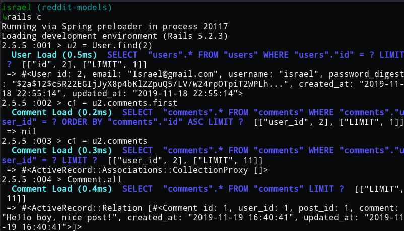
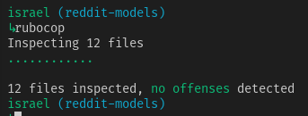

<!-- PROJECT SHIELDS -->
<!--
*** I'm using markdown "reference style" links for readability.
*** Reference links are enclosed in brackets [ ] instead of parentheses ( ).
*** See the bottom of this document for the declaration of the reference variables
*** for contributors-url, forks-url, etc. This is an optional, concise syntax you may use.
*** https://www.markdownguide.org/basic-syntax/#reference-style-links
-->
[![Contributors][contributors-shield]][contributors-url]
[![Forks][forks-shield]][forks-url]
[![Stargazers][stars-shield]][stars-url]
[![Issues][issues-shield]][issues-url]
[![MIT License][license-shield]][license-url]

<!-- PROJECT LOGO -->
 

  

  <h3 align="center">Project 2: Micro-Reddit</h3>

  

    Let’s build Reddit. Well, maybe a very junior version of it called micro-reddit. In this project, we built the data structures necessary to support link submissions and commenting. We won’t build a front end for it because we don’t need to… you can use the Rails console to play around with models without the overhead of making HTTP requests and involving controllers or views. 
     
    <a href="https://github.com/Israel-Laguan/micro-reddit/blob/master/README.md"><strong>Explore the docs �</strong></a>
     
     
    <a href="https://www.theodinproject.com/courses/ruby-on-rails/lessons/building-with-active-record-ruby-on-rails">Assigment</a>
    🐛
    <a href="https://github.com/Israel-Laguan/micro-reddit/issues">Report Bug</a>
    🙏
    <a href="https://github.com/Israel-Laguan/micro-reddit/issues">Request Feature</a>
  

# Micro-Reddit
Implement a version of Ruby’s enumerable methods.

[live version](https://micro-reddit-arir.herokuapp.com/)

# Validations

Rubocop: 

# Features

* Using different databases for development (sqlite3) and production (postgres)
* Followed the tutorial
* Tests made with [`RSpec`](https://relishapp.com/rspec/)

# Built With

* `ruby` v2.5.5
* `rails` v5.2.3+
* RVM
* `vscode` with _Ruby_ and _Rubocop_ extensions
* Linux
* Love and Passion for code.

# Authors

* [Aheebwa Ramadhan](https://github.com/raheebwa)
* [Israel Laguan](https://github.com/Israel-Laguan)

# License

This project is licensed under the MIT License - see the [LICENSE.md](LICENSE.md) file for details 

<!-- ACKNOWLEDGEMENTS -->
## Acknowledgements
* [Microverse](https://www.microverse.org/)
* [The Odin Project](https://www.theodinproject.com/)
* [Readme header](https://github.com/collinsugwu/Microverse201-Enumerable-Methods)

<!-- MARKDOWN LINKS & IMAGES -->
<!-- https://www.markdownguide.org/basic-syntax/#reference-style-links -->
[contributors-shield]: https://img.shields.io/github/contributors/Israel-Laguan/micro-reddit.svg?style=flat-square
[contributors-url]: https://github.com/Israel-Laguan/micro-reddit/graphs/contributors
[forks-shield]: https://img.shields.io/github/forks/Israel-Laguan/micro-reddit
[forks-url]: https://github.com/Israel-Laguan/micro-reddit/network/members
[stars-shield]: https://img.shields.io/github/stars/Israel-Laguan/micro-reddit
[stars-url]: https://github.com/Israel-Laguan/micro-reddit/stargazers
[issues-shield]: https://img.shields.io/github/issues/Israel-Laguan/micro-reddit
[issues-url]: https://github.com/Israel-Laguan/micro-reddit/issues
[license-shield]: https://img.shields.io/github/license/Israel-Laguan/micro-reddit
[license-url]: https://github.com/Israel-Laguan/micro-reddit/blob/master/LICENSE.txt